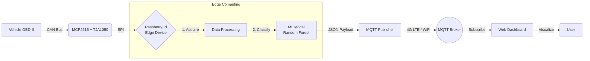

# 🚗 IoT Vehicle Status ML Classifier


> **Edge Computing and Machine Learning applied to real-time vehicle telemetry.**

This project implements a complete **End-to-End IoT solution** that acquires vehicle telemetry via OBD-II, processes it on the edge (Raspberry Pi), and uses a **Machine Learning model** to classify the driving state in real-time. The results are transmitted via **4G/LTE** to a cloud dashboard for visualization.

---

## 📸 Demo & Visualization

**Live Dashboard:** [View Dashboard Here](https://hugo31810.github.io/vehicle-status-ml-classifier/)

*(Place a screenshot of your dashboard here)*
``

---

## 💡 Project Overview

In the context of **Ambient Intelligence** and **Smart Transportation**, this project moves beyond simple data logging. It demonstrates **Edge Intelligence** by enabling the device to understand *what* the vehicle is doing, not just reporting raw numbers.

**Key Capabilities:**
* **OBD-II Acquisition:** Reads live data from the vehicle's CAN bus.
* **Auto-Labeling Pipeline:** Automatically generates labeled datasets using heuristic rules, eliminating manual tagging.
* **Edge Inference:** Runs a Random Forest classifier locally on the Raspberry Pi.
* **4G Connectivity:** Independent of Wi-Fi networks using the Air780EU module.
* **Decoupled Architecture:** Uses MQTT to separate data generation from visualization.

---

## 🌍 Real-World Applications

This system is not just an academic exercise; it addresses specific needs in the **Smart Transportation** industry:

### 1. 📉 Usage-Based Insurance (UBI)
Enables **"Pay-How-You-Drive"** models. Insurers can calculate dynamic risk profiles based on the frequency of `braking` (hard stops) and `acceleration` (aggressive driving) events rather than just distance driven.

### 2. 🌱 Eco-Driving & Sustainability
Acts as an active assistant to reduce carbon footprint. By detecting inefficient states like excessive `idling` or high `rpm` with low load, the system can prompt drivers to optimize fuel consumption.

### 3. 🚚 Fleet Management
Allows logistics managers to monitor vehicle health. Continuous detection of aggressive driving states helps predict mechanical wear (Predictive Maintenance) and ensures driver safety.

### 4. 🏙️ Smart Cities (Vehicle as a Sensor)
Aggregated data from multiple vehicles can identify road infrastructure issues. For example, frequent `braking` inference at a specific GPS coordinate may indicate a dangerous intersection or a pothole.

---

## 🏗️ System Architecture

The system follows a distributed architecture where the heavy lifting (inference) is done at the edge to reduce latency and bandwidth usage.



---

## 🧠 Machine Learning Approach

The goal is to classify the vehicle's behavior into 4 distinct states.

### 1. The Dataset

The dataset is generated continuously by the device. Features are extracted and labeled automatically based on dynamic thresholds (heuristic rules).

| Feature | Description |
| --- | --- |
| `speed` | Vehicle speed (km/h) |
| `rpm` | Engine Revolutions Per Minute |
| `throttle` | Accelerator pedal position (%) |
| `load` | Engine load (%) |
| `delta_speed` | Acceleration (derived from speed changes) |

### 2. The Classes

* 🟢 **Ralenti (Idle):** Vehicle stopped, engine running.
* 🔵 **Velocidad Constante (Cruising):** Stable speed, low variance.
* 🟡 **Aceleracion (Acceleration):** Positive delta speed, high throttle.
* 🔴 **Frenado (Braking):** Negative delta speed, sudden drop.

### 3. The Model

A **Random Forest Classifier** was selected for its robustness against noise and low computational cost during inference, making it ideal for the Raspberry Pi.

---

## 🛠️ Hardware & Tech Stack

### Hardware

* **Computing:** Raspberry Pi (Edge Device).
* **Interface:** MCP2515 CAN Bus Controller + TJA1050 Transceiver.
* **Connectivity:** Air780EU 4G LTE Module (UART).
* **Vehicle:** Any car with standard OBD-II support.

### Software

* **Language:** Python 3.
* **Libraries:** `python-can`, `paho-mqtt`, `pandas`, `scikit-learn`.
* **Web:** HTML5, CSS3, JavaScript (MQTT over WebSockets).
* **Tools:** Mosquitto Broker, Git.

---

## 🚀 Installation & Usage

### 1. Prerequisites

Ensure your Raspberry Pi has the CAN interface enabled in `/boot/firmware/config.txt`:

```bash
dtparam=spi=on
dtoverlay=mcp2515-can0,oscillator=8000000,interrupt=25

```

### 2. Clone and Install

```bash
git clone [https://github.com/Hugo31810/vehicle-status-ml-classifier.git](https://github.com/Hugo31810/vehicle-status-ml-classifier.git)
cd vehicle-status-ml-classifier
pip install -r requirements.txt

```

### 3. Run the System

To start data acquisition and inference:

```bash
python main.py

```

To run the dataset generator (for training new models):

```bash
python data_generator.py

```

---

## 📂 Project Structure

```text
.
├── dataset.csv                 # Generated CSV datasets
├── vehicle_state_model.pkl     # Trained .pkl models
├── main.py                     # Main execution script
├── data_generator.py           # Script for creating datasets
├── ml_train_vehicle_status.py  # ML loading and prediction logic
└── telemetria.py               # MQTT communication handler
├── index.html                  # Web interface (HTML/JS)
└── README.md

```

---

## 🔮 Future Improvements

* **Deep Learning:** Implementation of LSTM (Long Short-Term Memory) networks to analyze time-series sequences rather than instantaneous snapshots.
* **Anomaly Detection:** Unsupervised learning to detect mechanical failures or dangerous driving.
* **Integration:** Connection with ADAS (Advanced Driver Assistance Systems).

---

## 👨‍💻 Author

**Hugo Salvador Aizpún** *Degree in Artificial Intelligence* 

*Subject: Ambient Intelligence and Ubiquitous Computing*

[GitHub Profile](https://www.google.com/search?q=https://github.com/Hugo31810)

```

```
